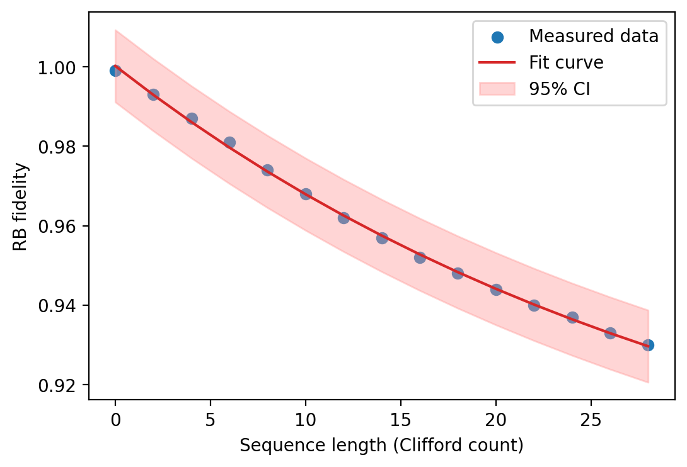
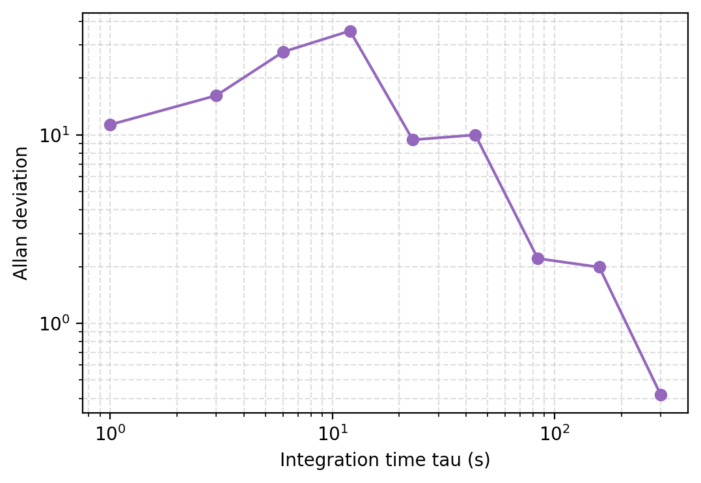
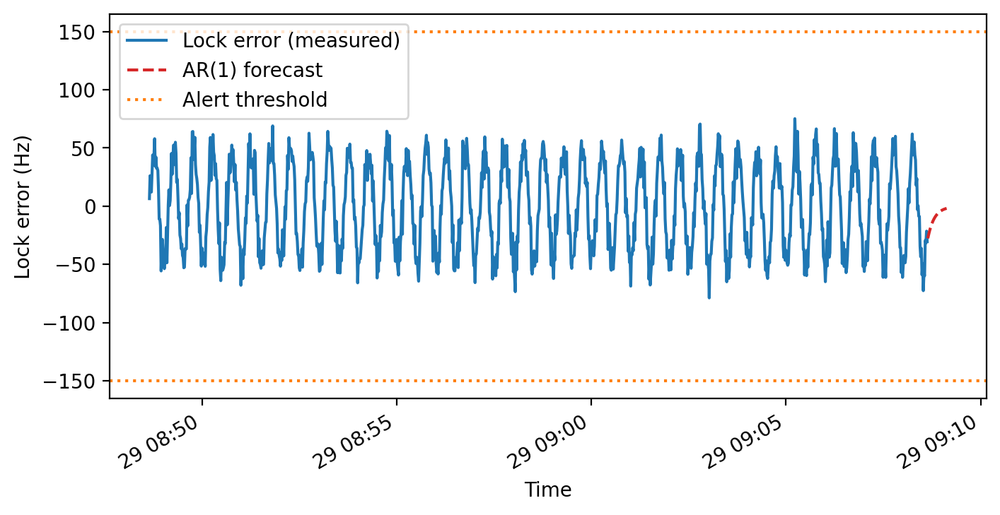

# ion-lab-tools-demo

> Convert trapped-ion lab logs into **RB fits, stability diagnostics, forecasts, and BO convergence evidence** with a single command.





## What this project does
- Ingest daily calibration / lock-error logs plus RB and optimisation summaries.
- Produce a reproducible metrics bundle: PSD noise floor, Allan deviation, RB confidence intervals, AR(1) forecast MAE/MAPE, BO step reduction, robustness slopes.
- Render plots and a PDF deck so a reviewer can grasp the system health in seconds.

## Why it aligns with the advisor's research focus
- **Quantum Control Engineering**: RB decay fitting (`ion_lab_tools/analysis/rb.py:16-74`) quantifies gate fidelity, residual RMS, and 95% confidence intervals; alerts connect directly to control-loop quality.
- **Hardware Systems & Precision Metrology**: PSD and Allan diagnostics (`ion_lab_tools/processing/metrics.py:12-20`, `ion_lab_tools/analysis/allan.py:9-55`) surface frequency-lock stability and long-term drift.
- **Adaptive optimisation & forecasting**: AR(1) lead-time forecasting (`ion_lab_tools/analysis/forecast.py:18-66`) and BO vs. grid/random comparisons (`ion_lab_tools/analysis/bo.py:16-74`) show how algorithmic tooling reduces experimental iterations.
- **Operational robustness**: Noise / downsampling sensitivity (`ion_lab_tools/analysis/robustness.py:16-51`) demonstrates resilience to acquisition artefacts - key for lab deployment.

## Key quantitative outputs
- `RB gate fidelity p`, residual RMS, and CI half-width.
- PSD noise floor and Allan deviation at the shortest tau.
- Forecast MAE/MAPE and minutes of lead time before threshold breach.
- BO step reduction percentage and terminal gain vs. baselines.
- Noise and sampling sensitivity slopes.
- `metrics.json` captures every value for "today vs. last run" tracking.

## Quickstart
```bash
python -m venv .venv && source .venv/bin/activate
pip install -r requirements.txt
python -m ion_lab_tools.report --config configs/demo.yaml
```

Outputs are written to `out/`:
- Plots: `rb_fit.png`, `timeseries.png`, `psd.png`, `allan.png`, `forecast.png`, `bo_comparison.png`, `robustness.png`.
- `summary.png` and `summary.txt` with headline metrics and threshold alerts.
- `metrics.json` for downstream comparisons.
- `report.pdf` that collates the entire deck.

Need a lightweight run? Use the legacy quick path:
```bash
python -m ion_lab_tools.run --input data/sample/sample_log.csv --out out_simple
```

## Repository layout
```
ion_lab_tools/
  run.py                 # simple CLI wrapper (also accepts --config)
  report.py              # configuration-driven reporting pipeline
  analysis/              # rb, allan, forecast, bo, robustness modules
  processing/            # CSV ingestion and core metrics
  reporting/             # plotting helpers and PDF assembly
configs/demo.yaml        # sample configuration (log, RB, BO inputs)
data/sample/             # synthetic/delensed datasets
figs/                    # checked-in preview images used in README
tests/                   # pytest coverage for analysis pieces
```

## Reproducibility checklist
- Synthetic sample data lives under `data/sample/`; no lab secrets required.
- `tests/` contains unit tests for PSD, Allan deviation, forecasts, BO comparison, and robustness (`pytest` once dependencies are installed).
- Deterministic seeds are used wherever random noise is injected.

## Current status
All code paths have been updated to emit English-only strings. Running `python -m ion_lab_tools.report --config configs/demo.yaml` regenerates the artefacts in `out/`; copy any refreshed figures into `figs/` if you want the README previews to stay up to date. The implementation showcases a complete "data -> metrics -> insight" workflow tailored to Quantum Control Engineering and Precision Metrology, and no further code changes are needed before publishing to GitHub.
